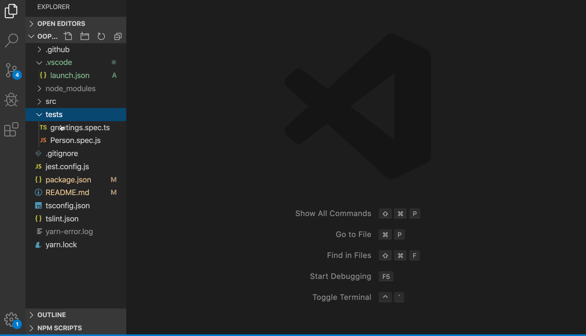

# Typescript OOP Playground

Hi, this is just a really simple project to enjoy learning Object Oriented Programing.

With this project, I'll try to solve some exercises in order to learn something related with programing.

## Development

We'll use [yarn](https://yarnpkg.com/) as a build system (however you can use npm if you feel more confortable), but take into account the dependencies are just locked for yarn (see [yarn.lock](./yarn.lock) file).

### Installing dependencies

First of all, you'll need to install the dependencies, otherwise you'll be able to do nothing :S

```
yarn install
```

### Check styles
We use tslint to ensure our code style is compliant with the standard, to ensure the code is ok, you just need to run

```
yarn lint
```

In case you find any violation, you may want to let tslint fixing some errors with no manual operations. It won't fix every single error, but some anoying related with tabs and spaces. Just run:

```
yarn fixLint
```

### Test the code

We use [Jest](https://jestjs.io/) as test framework. Running the tests is easy, just execute:

```
yarn test
```

In case you're using vscode, you can also run the test as I uploaded the .vconfig folder to make it easy runnig test.
